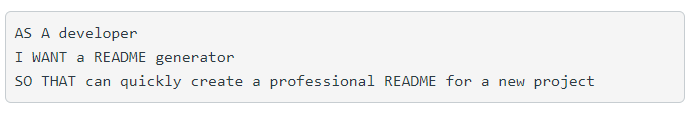
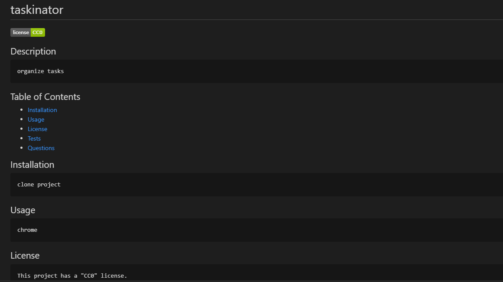

# Readme Generator

## User Story

## Acceptance Criteria

## Work Completed
- Added a series of questions prompting the user to fill out various sections of readme using inquirer to index.js
- Updated generateMarkdown file to include base code for readme generation
- Added image at top of readme with custom code to create visual of badge for software license
- Configured username and email address to provide links to github profile and email

## Video Demonstration
Here is a video demonstrating the application [Video Recording](https://drive.google.com/file/d/1HfFw43S9OjYVfRAr7imvvhK6kdvEtgCi/view)

## Github Link
[Github Repo](https://github.com/catse2000/readme-generator)

## Screenshot

